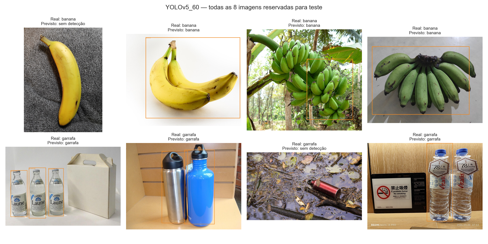

# FarmTech Solutions — visão computacional

**Matheus Silva Riscado · RM573622 · projeto individual · Fase 6**

Protótipo didático para reconhecer garrafas e bananas em imagens e comparar YOLOv5 customizado, YOLOv3 pré-treinado e uma CNN treinada do zero.

**Estado em 06/10/2026: modelos executados e segunda execução integral em sessão limpa aprovada. Vídeo e envio pelo portal pendentes.**

A [validação dos rótulos](docs/VERIFICACAO-ROTULOS.json) registra os dados reais. A [verificação da execução](docs/VERIFICACAO-EXECUCAO.json) documenta as 15 células executadas, sem saídas de erro, e os hashes dos 96 artefatos recuperados do Drive. O [checklist do barema](docs/CHECKLIST-BAREMA.md) acompanha os cinco critérios.

São 40 fotos de garrafas (14 do autor e 26 do Wikimedia Commons) e 40 de bananas (Wikimedia Commons). Cada classe tem 32 imagens de treino, 4 de validação e 4 de teste. Três fotos adicionais do autor, com as duas classes juntas, estão separadas para demonstração qualitativa.

Procedência e créditos: [manifesto das 80 imagens](dataset/fontes.csv), [garrafas](coleta/garrafas/CREDITOS.md) e [bananas](coleta/bananas/CREDITOS.md). O [protocolo de rotulação](docs/PROTOCOLO-ROTULACAO.md) define as caixas; o [registro de verificação](docs/VERIFICACAO-COLETA.json) documenta apenas a coleta, sem resultados de modelos.

## Acessos

- [Notebook executado do projeto](MatheusSilvaRiscado_rm573622_pbl_fase6.ipynb): método, código, resultados e discussão.
- **[Abrir no Colab](https://colab.research.google.com/github/teteuriscado-bot/MatheusSilvaRiscado/blob/main/MatheusSilvaRiscado_rm573622_pbl_fase6.ipynb)**: versão pública obtida deste repositório.
- Vídeo no YouTube: **PENDENTE — incluir vídeo não listado de até 5 minutos.**
- [Dataset para reprodução — ZIP](https://github.com/teteuriscado-bot/MatheusSilvaRiscado/releases/download/fase6-2026-10-04/DATASET-FARMTECH-FASE6.zip): 80 fotografias, rótulos, créditos e manifesto.
- [Instruções de reprodução](docs/REPRODUCAO.md): executar em outra conta sem acessar o Drive do autor.
- [Resultados da execução](resultados/20261004T164740010266Z/): CSVs, curvas e oito imagens de teste.
- [Pesos e pacote completo de resultados](https://github.com/teteuriscado-bot/MatheusSilvaRiscado/releases/tag/fase6-2026-10-04): os 96 artefatos, modelos treinados e hashes para conferência.

As instruções completas e a análise estão no notebook; o [guia de entrega](COMECE-AQUI.md) e o [roteiro do vídeo](docs/ROTEIRO-VIDEO.md) orientam os próximos passos. A sessão original teve retomadas para autorização do Drive e correção do download dos pesos; a segunda reprodução integral foi concluída em 06/10/2026, sem erros. A [evidência da sessão limpa](evidencias/reexecucao-20261006/README.md) registra código, saídas, hashes e diferenças entre as rodadas.

O experimento usa 64 imagens para treino, 8 para validação e 8 para teste. A base pequena serve a uma demonstração acadêmica e exige cautela na interpretação de generalização.

Prazo informado: **13/10/2026**. Repositório individual `MatheusSilvaRiscado`; envio pelo portal pendente. Confirmar o horário-limite e não fazer commits após o envio final.
